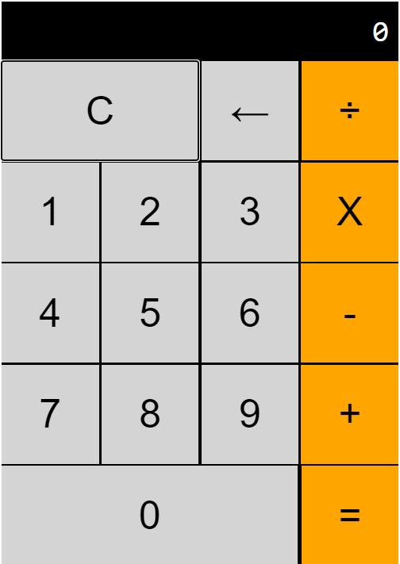

# Calculadora

O projeto consiste na criação de uma calculadora utilizando HTML, CSS e JS puros.

Funcionalidades desenvolvidas:

- Layout similar ao da calculadoa do iphone
- 4 operações básicas (+, -, *, /)
- Limpar o display da calculadora
- limpar o último digito

Funcionalidades não presentes:

- porcentagem 
- ponto decimal

Há duas maneiras de se obter um resultado: realizando mais de uma operação ou apertando em igual.

A calculadora tem alguns problemas em lidar com números decimais.

